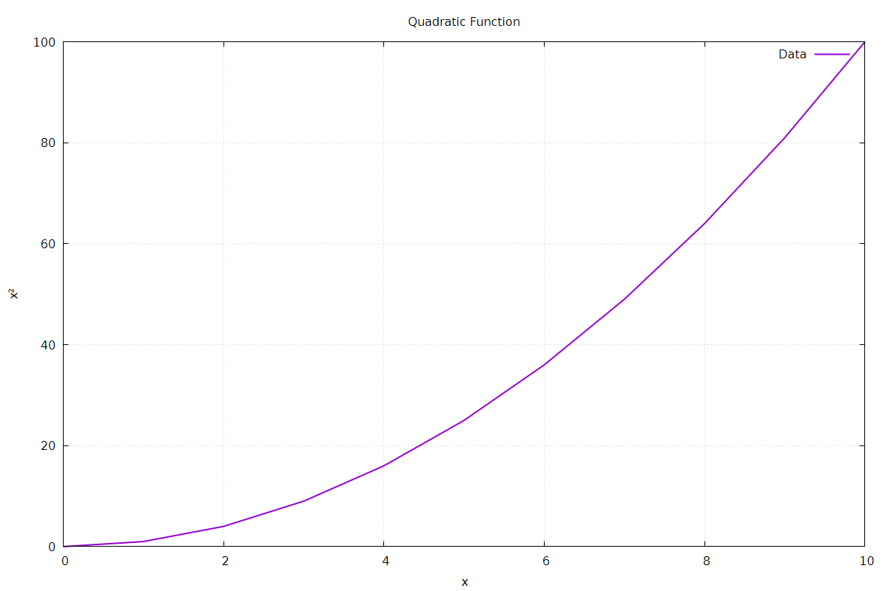
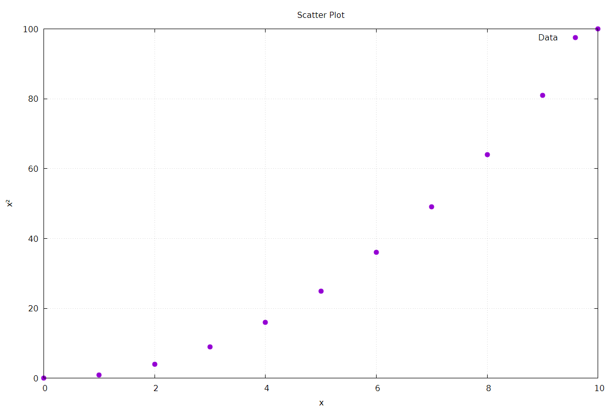
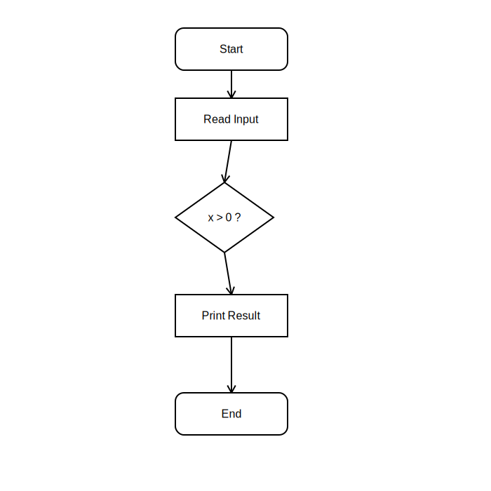

# libdoodle

*A lightweight C++20 plotting and diagram library for research and technical documentation.*

libdoodle is a compact C++ library designed for generating publication-quality figures directly from C++ programs. It provides a simple interface for creating plots, charts, diagrams and flowcharts while relying on **Gnuplot** and **SVG** as rendering backends.

Unlike heavyweight visualization frameworks, libdoodle is intended to be a lightweight utility for engineering and scientific projects where figures are generated alongside simulations or experiments.

---

## Features

- Line plots
- Scatter plots
- Bar charts
- Histograms
- SVG block diagrams
- Flowcharts
- PNG export
- SVG export
- PDF export
- Modern C++20 API

---

## Gallery

### Line Plot

<p align="center">
    
</p>

---

### Scatter Plot

<p align="center">
    
</p>

---

### Flowchart

<p align="center">
    
</p>

---

## Example

```cpp
#include <doodle/doodle.hpp>

#include <vector>

int main()
{
    std::vector<double> x{0,1,2,3,4,5};
    std::vector<double> y{0,1,4,9,16,25};

    doodle::Plot plot;

    plot.title("Quadratic Function")
        .xlabel("x")
        .ylabel("x²")
        .grid(true)
        .line(x, y);

    plot.export_png("quadratic.png");
}
```

---

## Building

### Requirements

- C++20 compiler
- CMake ≥ 3.20
- Gnuplot
- Ninja (recommended)

### Build

```bash
cmake -B build -G Ninja
cmake --build build
```

---

## Project Structure

```
libdoodle/
├── include/
│   ├── doodle.hpp
│   └── doodle/
├── src/
├── tests/
├── examples/
└── CMakeLists.txt
```

---

## Current Capabilities

| Feature | Status |
|---------|:------:|
| Line Plot | ✅ |
| Scatter Plot | ✅ |
| Bar Chart | ✅ |
| Histogram | ✅ |
| SVG Diagrams | ✅ |
| Flowcharts | ✅ |
| PNG Export | ✅ |
| SVG Export | ✅ |
| PDF Export | ✅ |

---

## Roadmap

Future releases may include:

- Multiple data series
- Pie charts
- Themes
- Automatic layout engine
- Orthogonal routing
- Additional diagram primitives
- Graphviz interoperability

---

## License

This project is released under the MIT License.